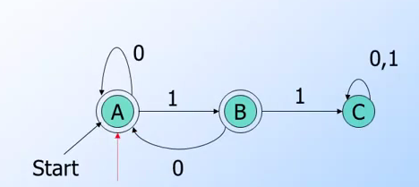
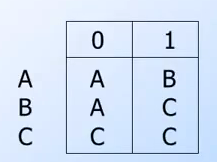

DFA: Deterministic Finite Automata
==============

[](https://raw.githubusercontent.com/kkdai/dfa/master/LICENSE)  [](https://godoc.org/github.com/kkdai/dfa)  [](https://travis-ci.org/kkdai/dfa)




What is Deterministic Finite Automata
=============
In theory of computation, a branch of theoretical computer science, a deterministic finite automaton (DFA)—also known as deterministic finite state machine—is a finite state machine that accepts/rejects finite strings of symbols and only produces a unique computation (or run) of the automation for each input string.[1] 'Deterministic' refers to the uniqueness of the computation. In search of simplest models to capture the finite state machines, McCulloch and Pitts were among the first researchers to introduce a concept similar to finite automaton in 1943.  (sited from [here](https://en.wikipedia.org/wiki/Deterministic_finite_automaton))


Output Traisition Table
=============

This package also can output transition table, which is a way to represent all transition function in this DFA.




Installation and Usage
=============


Install
---------------

```go

go get github.com/kkdai/dfa

```

Usage
---------------

```go

package main

import (
    "github.com/kkdai/dfa"
    "fmt"
)

func main() {
	dfa := NewDFA(0, false)
	dfa.AddState(1, false)
	dfa.AddState(2, true)

	dfa.AddTransition(0, "a", 1)
	dfa.AddTransition(1, "b", 2)

	var inputs []string
	inputs = append(inputs, "a")
	inputs = append(inputs, "b")
	fmt.Println("If input a, b will go to final?", dfa.VerifyInputs(inputs) )
}

```

Inspired By
=============

- [DFA: Wiki](https://en.wikipedia.org/wiki/Deterministic_finite_automaton)
- [fffaraz/DFA](https://github.com/fffaraz/DFA)
- [Coursera: Automata](https://class.coursera.org/automata-004/)

Project52
---------------

It is one of my [project 52](https://github.com/kkdai/project52).


License
---------------

This package is licensed under MIT license. See LICENSE for details.
